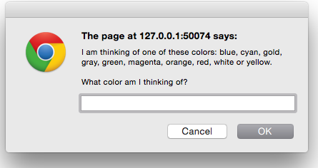

# HCJ_Assignment02_ColorGuessGame
This project was to demonstrate the usage of Javascript using loops, comparators
and simple manipulation of the DOM.

A color is picked at random from a list. Your job is to guess the color with
hints about the alphabetization status of the mistery color.

Opening alert:
[//]: # (Comment) 
<figure></figure>
